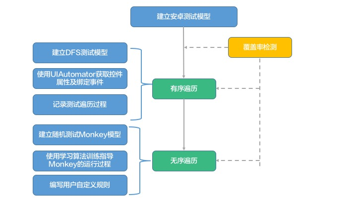
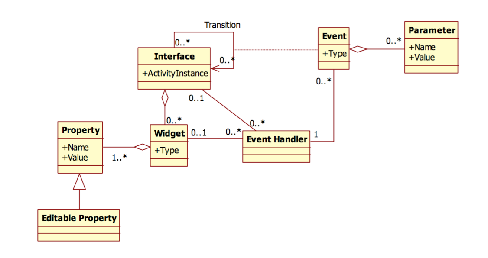
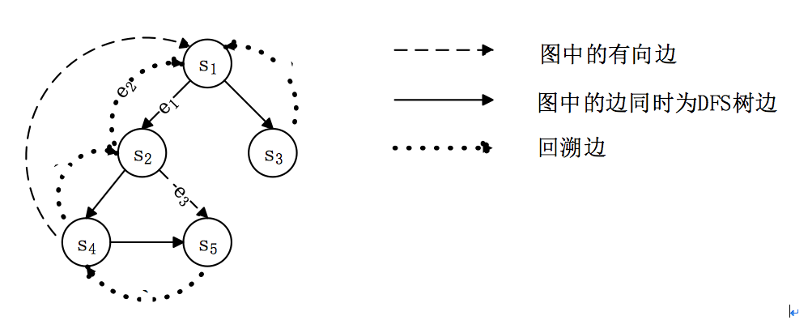
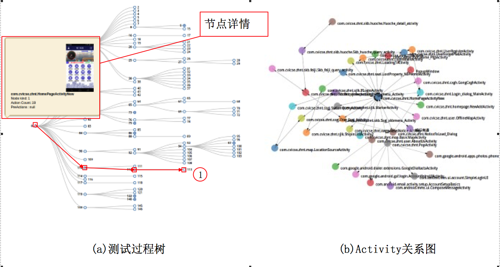
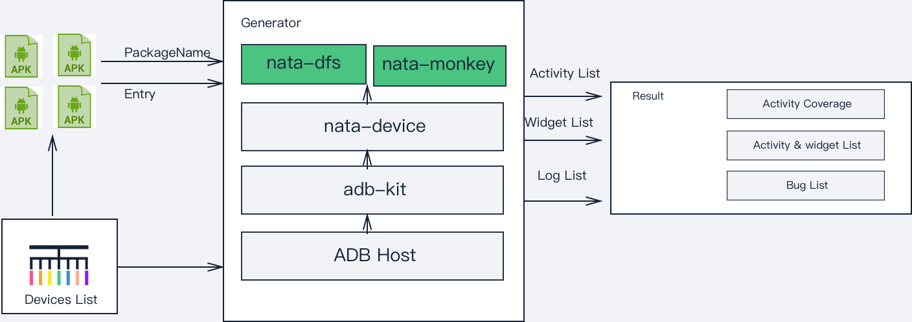
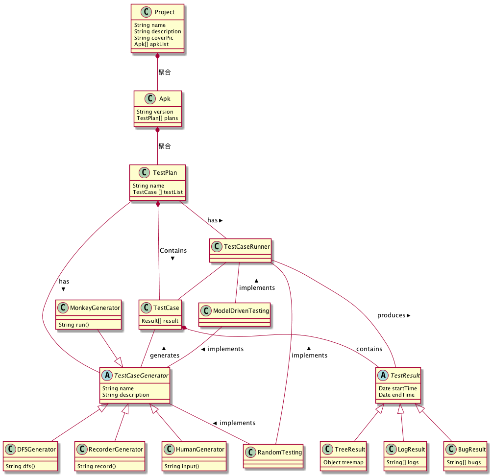
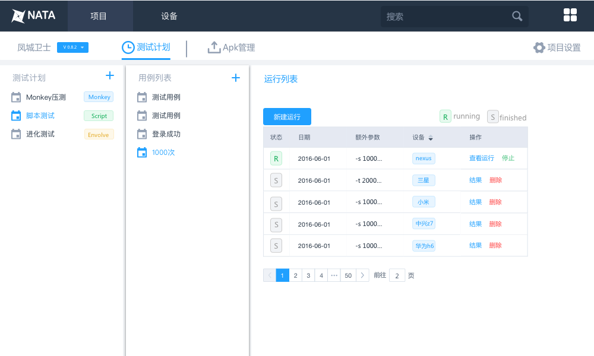
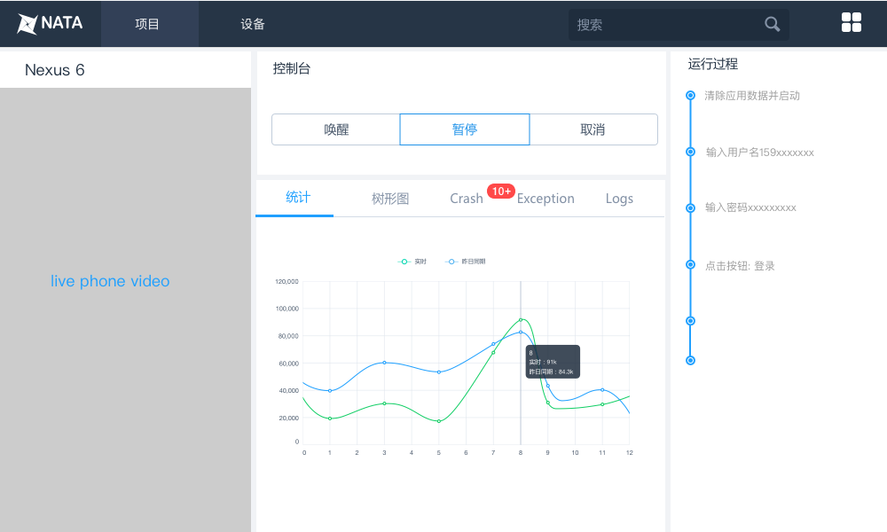
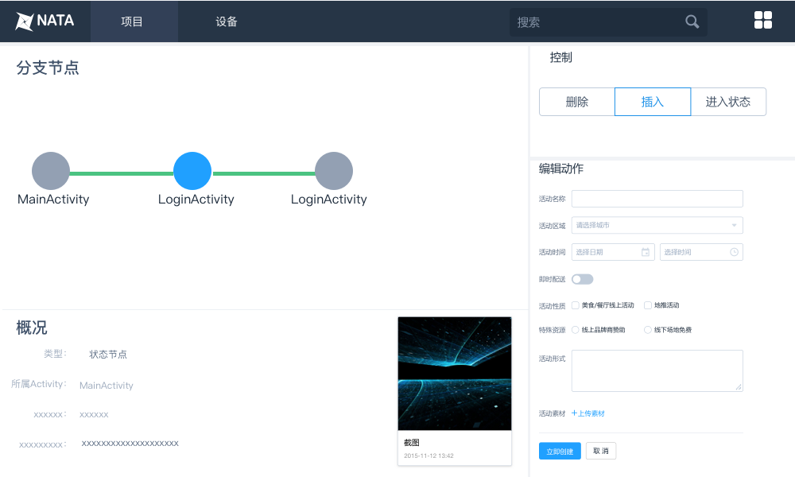
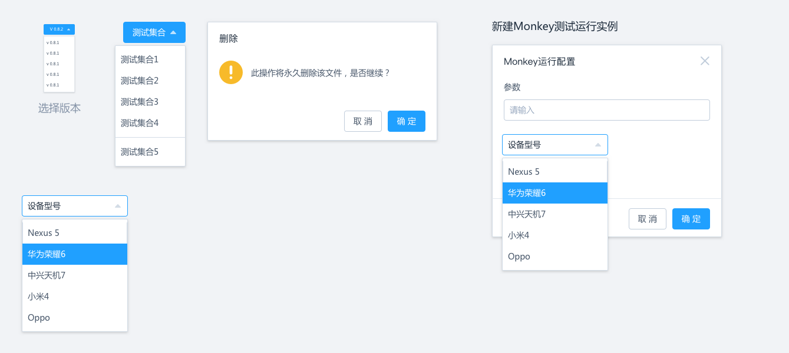

# NATA
NATA是NJU Android Test Automator的简称,顾名思义Nata致力于研究安卓自动化测试技术,并提升其效率。

## 主要研究内容
Nata主要研究智能机控件遍历技术，即GUI自动化测试，该技术是Android应用测试研究领域重要组成部分，实现自动化测试技术的一个重要基础即是有效地获取智能机控件，并在此基础上进行测试。Nata主要研究两种类型的测试技术，一种是基于DFS深度遍历模型的有序遍历，一种是基于随机Monkey的无序遍历测试，遍历测试具有简单、高效的特点，为当今移动应用自动化测试技术发展的新趋势，而随机测试的随机测试序列很可能能够触发在一般操作序列中无法发现的应用错误, 常用于应用压测。

在安卓中，应用将自己的逻辑组织到Activity中，每个Activity代表一个UI界面,例如一个邮件App可能包括用户登录，邮件列表，阅读邮件和发送邮件等界面,每个App的Activity数量差异很大，从几个到几百个不等。每个Activity都包含了一系列用户可以与之交互的组件，Android为我们提供了一系列标准控件，例如按钮，文本框，开关，选择器等等。控件负责处理绑定于它身上的UI事件，如何点击，长按，输入，滑动等。

Nata测试的主要任务即尽可能多地遍历Activity并识别组成该Acitivity的控件以及发现尽可能多的错误情况，通过模拟用户行为触发绑定的UI事件，达到自动测试的效果，减少人工测试造成的时间损耗，并尽可能在测试过程中发现应用的问题，由开发人员迅速修正。

## 技术路线
在Nata的实现过程中我们会分别建立无序遍历工具和有序遍历工具，然后测试其对于Activity和控件的覆盖率，如果没有达到特定的要求，我们会对测试过程进行评估，找到测试工具没有找到的Activity以及什么原因导致其未能找到该Activity并在下一次的迭代中重点解决这些问题。以此循环往复直到达到要求。


首先Nata需要建立安卓应用的测试模型即对安卓应用行为进行建模，如下图所示,安卓应用的GUI界面由一组相互关联的Activity组成，每个Activity由一组控件组成，每个控件上绑定了一些事件，用户通过和控件交互产生一系列事件，进而驱动页面跳转。因此我们需要建模的对象有Activity，Widget，Event，以及Action。



对于有序遍历，我们认为DFS搜索算法最符合人类使用手机应用的习惯，因此使用DFS建立测试过程。在DFS探索过程中首先要获得当前界面的控件以及绑定的事件，然后通过从上到下按照页面控件排布的顺序依次触发控件所绑定的事件来对所有控件及事件进行完全的遍历，在触发控件后页面可能跳转到其他界面，此时遍历其他界面，遍历完成后回到当前界面继续遍历，直到根界面的控件全部遍历完成。最终遍历过程将会形成一个DFS遍历树，其节点为界面状态，边为导致状态发生改变的控件以及相应事件。


对于无序遍历,最原始的随机测试可能会对界面进行任意的行为，如滑动，点击，输入，后退等一系列行为，它没有导向，行为的产生完全依靠随机事件。另一类的随机测试会对应用本身有一个基本的了解,例如他知道某些控件是处于不可用状态，因此不会尝试点击，我们甚至可以通过算法指导其选择行为以更好的契合我们的研究目标，例如我们希望在随机测试过程中尽可能多的发现新的Activity，那么我们可以让测试工具倾向于触发之前未被触发的事件，在整个测试的过程中控件被选择的概率随着后续探索的结果而动态改变。测试人员甚至可以自定义一些动作，让工具忽略特定的控件（如关机按钮）或执行特定的动作（如拖动控件）。


## 测试方法

### Monkey测试
[Monkey](https://developer.android.com/studio/test/monkey.html)测试是Android自动化测试的一种手段,它是Android系统自带的一个运行于物理设备或者模拟器上的伪随机事件生成工具。Monkey测试本身非常简单，它可以自动地生成伪随机的用户事件，例如点击、触摸或者手势，同时还有一些系统事件，看设备多长时间会出异常。你可以使用Monkey对你开发的应用进行压力测试，虽然事件产生是随机的，但是该过程可以通过设置相同的随机种子来重现测试过程。

Monkey工具包括很多选项，主要分为四类:

1. 基本的控制选项，比如设置生成事件的总数
2. 操作限制选项，比如限制只能在单个包中进行测试
3. 各种不同的事件类型以及其生成频率
4. 调试相关的选项

Monkey运行时会产生各种不同的随机事件并发送给系统,在运行过程中如果应用产生了无法处理的异常或者应用无法响应，monkey会停止运行并报告错误,另外我们可以通过设置提示的等级，提示登记越高monkey报告的信息会越详细.Monkey运行在命令行下,一个典型的命令行的语法为
```
$ adb shell monkey [options] <event-count>
```
比如我们希望测试包名为your.package.name的应用，并生成500个事件,我们可以设置为:
```
$ adb shell monkey -p your.package.name -v 500
```


### DFS测试
DFS测试是使用深度优先算法，依次遍历应用中各个UI组件的测试技术。在Android应用测试中运用DFS算法，首先需要在图结构中定义State和Event这两个概念。如下图所示的深度优先的探索过程，节点s1~s5表示State，有向边e1和e3表示Event。e1驱动s1到s2，e3驱动s2到s5，由于s5已经探索过，所以e3并不在DFS树中。e2为s2状态探索完毕后回溯到s1的过程，并不为Event。


算法实现中具体的技术难点我们通过如下方案解决：

- Android应用状态的判定。Android应用GUI状态繁多，需要一个有效的方式来识别和确认自动化测试过程中的状态。我们通过adb工具获取当前GUI状态中的Activity，使用UIautomator获取GUI中的组件结合，由这两个属性来确定GUI的状态。
- 路径爆炸的处理。在自动遍历复杂的应用时，极易出现路径爆炸的情况，导致遍历过程极为耗时。所以，需要一个有效的方法来处理这个问题。我们采用了近似的状态判定方法，对于两个状态相似的GUI，不再重复的进行探索，从而提高了遍历的效率。
- 驱动事件的获取。驱动应用状态变化的原因，是用户操作、系统事件和传感器事件等，有效地产生这些事件才能探索到尽可能多的GUI状态。我们利用了Java的reflect机制获取注册的监听器和UIautomator获取的xml识别组件类型，从而产生驱动事件。
- 回溯方法的实现。在DFS算法中，返回上一个状态的过程称为回溯，回溯可以保证应用状态的重现，从而继续遍历剩余的组件。我们采用试探性回溯，减少回溯过程的耗时。
- 结束状态的判定。能够使遍历过程在有限时间内停止，是整个算法有效性的保证，我们设定了探索的终止条件，保证遍历的机制的可行性。

最后会生成DFS搜索树状图，和Activity关系图：


上图所示的是基于DFS的GUI探索过程生成的DFS树，同时给出了每一个Sate的详情，同时，从根节点至叶子节点可以构成一个测试用例，如图中(1)，方便测试者重现测试过程，或者进行回归测试。右图所示为通过测试分析得到的各个Activity之间的关系，通过分析Activity之间的关系，测试者可以判断应用跳转是否正确，判断整体设计概念是否符合用户需求。DFS测试技术可以应用于Android应用开发初期的集成测试，辅助测试者快速有效的发现错误，同时生成测试用例可用于应用的回归测试。

### Ape测试
Ape测试是在Monkey测试工具的基础上进行改进，使得产生的随机事件能够落在有效的组件上，减少无效的事件产生。


## 实验评估手段
实验将通过中兴提供的Apk信息获取工具获得待测手机上的所有待测应用的列表,通过选择待测应用并选择相应的测试方案，将输出测试过程中遍历到的Activity列表以及控件列表，计算Activity的覆盖率，以及整个过程消耗的测试时间等。




## Nata系统设计类图
Nata的设计围绕项目和测试用例展开,下面分别对图中出现的类进行解释
- Project<项目>. 项目代表你要测试的对象，他拥有名称，描述，封面等属性以及一个Apk的列表
- Apk<Android Application制品>. 一个Apk代表该项目的一次版本构建，它具有一个版本号以及相关联的一组测试计划的列表
- TestPlan<测试计划>. 测试计划代表你的测试意图，类似于单元测试中的测试集合的概念,测试计划有一个名称以及一组测试用例的列表。每个测试计划需要某个具体的测试技术相关联,由该测试技术提供相应的生成器和执行器.
- ModelDrivenTesting<模型驱动测试>. 对应用进行建模，刻画应用运行的有限自动机,模拟其运行过程.
- RandomTest<随机测试>. 对待测应用产生随机的测试流，通过大量随机的事件对系统进行压力测试，触发意想不到的bug.
- TestCase<测试用例>. 测试用例是最小的测试运行单位，通常为脚本形式，用于测试特定的应用功能，测试用例可以多次运行，生成一组测试结果的列表
- TestCaseGenerator<测试用例生成器>. 用于产生测试用例,可以通过多种技术生成.
- TestCaseRunner<测试用例运行器>. 用于运行测试用例，通常由具体的测试方法提供运行器
- DFSGenerator<基于DFS算法的测试用例生成器>. 使用DFS算法对应用进行建模，遍历测试并生成测试脚本.
- RecordGenerator<录制生成器>. 通过人工干预的方式录制测试用例，生成测试脚本.
- HumanGenerator<人工生成器>. 手工录入测试脚本.
- MonkeyGenerator<随机生成器>. 通过随机算法生成随机测试脚本.
- TestResult<测试结果>. 运行测试用例产生的测试结果,包括该测试脚本运行的起始时间和结束时间.
- TreeResult<树形图>. 测试结果的一种，一棵从根节点出发的应用遍历图
- LogResult<测试结果日志>. 测试过程中的日志输出
- BugResult<应用Bug列表>. 通过筛选应用的日志生成的出现错误的运行时列表



## UI设计

### 主页项目列表
项目总览为应用的主视图，在这个界面中可以浏览所有待测的应用，每个应用表现为一张卡片，有一个自己的名称和描述，以及对应的一个具有辨识度的封面。


### 创建新项目
项目可以创建和更新,字段包括名称,描述和封面


### 主页设备列表
设备列表管理所有连接的设备,上方为设备信息的总览，如设备的总数，可用的设备，忙设备的数量等。下方点击某个设备，可以在右方看到每个设备的具体信息.


### Apk管理界面
点击某个项目会进入到这个项目的管理界面，对应的有不同的应用版本,这个在Apk的列表中进行管理,包括Apk上传的日期，名称，版本号，描述，你可以下载对应的版本，也可以删除，不过删除的时候会将该版本关联的测试用例一并删除，请特别留意.


### 运行列表
每个具体的应用版本都有一个测试计划的列表，每个测试计划都有一个测试用例的列表，每个测试用例可以被运行多次，形成一个运行列表，可以直观的看到其运行状态,开始的时间，参数，运行的设备，如果已经运行完可以查看其运行结果,如果正在运行可以查看其运行的过程


### 运行界面
测试用例运行时的观察界面，左侧可以实时观察到设备的运行情况,右侧可以对该测试用例进行控制以及观察到其实时运行的情况


### 脚本测试
对于DFS测试，录制测试，人工输入等各种可以生成测试脚本的测试技术我们统称为脚本测试，其界面为脚本的编辑界面,测试人员可以运行，编辑或删除该脚本


### 选取分支
对于某个测试用例，如果具有生成树，那么我们可以通过选取某个分支来修改该分支脚本,可以看到该分支的概况以及运行时的截图等信息


### 编辑界面
编辑界面可以看到改脚本的具体分支节点,可以对该节点进行控制或者对该节点的脚本进行编辑


### 弹出框
弹出框部分为系统中可能出现的弹出界面，包括选择版本，删除Apk，新建用例等



