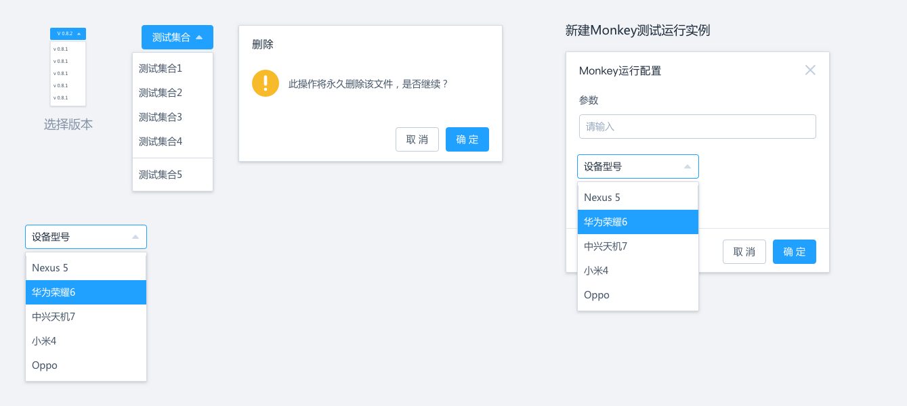

# NATA 设计稿

#### 设计类图
Nata的设计围绕项目和测试用例展开,下面分别对图中出现的类进行解释
- Project<项目>. 项目代表你要测试的对象，他拥有名称，描述，封面等属性以及一个Apk的列表
- Apk<Android Application制品>. 一个Apk代表该项目的一次版本构建，它具有一个版本号以及相关联的一组测试计划的列表
- TestPlan<测试计划>. 测试计划代表你的测试意图，类似于单元测试中的测试集合的概念,测试计划有一个名称以及一组测试用例的列表。每个测试计划需要某个具体的测试技术相关联,由该测试技术提供相应的生成器和执行器.
- ModelDrivenTesting<模型驱动测试>. 对应用进行建模，刻画应用运行的有限自动机,模拟其运行过程.
- RandomTest<随机测试>. 对待测应用产生随机的测试流，通过大量随机的事件对系统进行压力测试，触发意想不到的bug.
- TestCase<测试用例>. 测试用例是最小的测试运行单位，通常为脚本形式，用于测试特定的应用功能，测试用例可以多次运行，生成一组测试结果的列表
- TestCaseGenerator<测试用例生成器>. 用于产生测试用例,可以通过多种技术生成.
- TestCaseRunner<测试用例运行器>. 用于运行测试用例，通常由具体的测试方法提供运行器
- DFSGenerator<基于DFS算法的测试用例生成器>. 使用DFS算法对应用进行建模，遍历测试并生成测试脚本.
- RecordGenerator<录制生成器>. 通过人工干预的方式录制测试用例，生成测试脚本.
- HumanGenerator<人工生成器>. 手工录入测试脚本.
- MonkeyGenerator<随机生成器>. 通过随机算法生成随机测试脚本.
- TestResult<测试结果>. 运行测试用例产生的测试结果,包括该测试脚本运行的起始时间和结束时间.
- TreeResult<树形图>. 测试结果的一种，一棵从根节点出发的应用遍历图
- LogResult<测试结果日志>. 测试过程中的日志输出
- BugResult<应用Bug列表>. 通过筛选应用的日志生成的出现错误的运行时列表

#### 主页项目列表
项目总览为应用的主视图，在这个界面中可以浏览所有待测的应用，每个应用表现为一张卡片，有一个自己的名称和描述，以及对应的一个具有辨识度的封面。

#### 创建新项目
项目可以创建和更新,字段包括名称,描述和封面

#### 主页设备列表
设备列表管理所有连接的设备,上方为设备信息的总览，如设备的总数，可用的设备，忙设备的数量等。下方点击某个设备，可以在右方看到每个设备的具体信息.

#### Apk管理界面
点击某个项目会进入到这个项目的管理界面，对应的有不同的应用版本,这个在Apk的列表中进行管理,包括Apk上传的日期，名称，版本号，描述，你可以下载对应的版本，也可以删除，不过删除的时候会将该版本关联的测试用例一并删除，请特别留意.

#### 运行列表
每个具体的应用版本都有一个测试计划的列表，每个测试计划都有一个测试用例的列表，每个测试用例可以被运行多次，形成一个运行列表，可以直观的看到其运行状态,开始的时间，参数，运行的设备，如果已经运行完可以查看其运行结果,如果正在运行可以查看其运行的过程

#### 运行界面
测试用例运行时的观察界面，左侧可以实时观察到设备的运行情况,右侧可以对该测试用例进行控制以及观察到其实时运行的情况

#### 脚本测试
对于DFS测试，录制测试，人工输入等各种可以生成测试脚本的测试技术我们统称为脚本测试，其界面为脚本的编辑界面,测试人员可以运行，编辑或删除该脚本

#### 选取分支
对于某个测试用例，如果具有生成树，那么我们可以通过选取某个分支来修改该分支脚本,可以看到该分支的概况以及运行时的截图等信息

#### 编辑界面
编辑界面可以看到改脚本的具体分支节点,可以对该节点进行控制或者对该节点的脚本进行编辑

#### 弹出框
弹出框部分为系统中可能出现的弹出界面，包括选择版本，删除Apk，新建用例等
